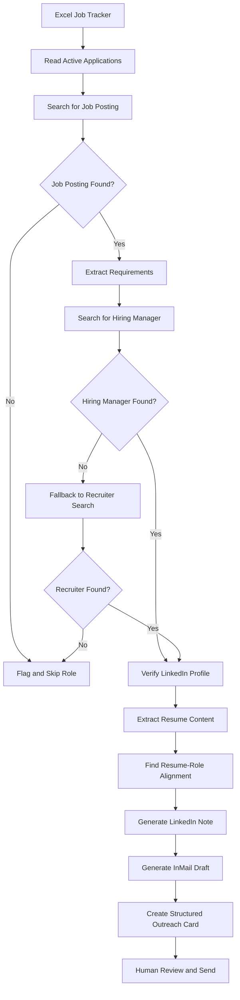

# AI Agent for Personalized LinkedIn Outreach

## Overview

Job seekers know that direct outreach to recruiters and hiring managers improves response rates. The problem is that personalized outreach does not scale well. Researching the right contact, understanding the role, identifying relevant alignment points from a resume, and drafting a thoughtful message can take 20–30 minutes per application.

This project automates the research and drafting workflow while keeping the human in control of the final send step.

I built a Python-based AI agent that reads active applications from my job tracker, researches each role, identifies likely hiring contacts, analyzes resume-role alignment, and generates ready-to-send LinkedIn outreach drafts.

The system is intentionally designed with scoped autonomy:
- The agent performs reversible tasks like research, synthesis, and drafting
- The human reviews and sends the message manually
- The system never logs into LinkedIn or performs irreversible actions autonomously

---

# Flowchart



---

# The Problem

Most job seekers apply to dozens of roles but rarely follow up directly with recruiters or hiring managers. This is not usually a motivation problem. It is a coordination and time problem.

A single personalized outreach flow typically requires:
1. Finding the correct job posting
2. Identifying the relevant recruiter or hiring manager
3. Verifying the contact
4. Reading the role requirements
5. Mapping resume experience to the role
6. Drafting a personalized message

Doing this manually across 10–15 active applications becomes difficult to sustain consistently.

This project was built to reduce that overhead while preserving personalization and human review.

---

# What the Agent Does

For each active application in an Excel-based job tracker, the agent:

1. Reads company name, role title, and application status
2. Searches for the live job posting
3. Extracts key responsibilities and requirements
4. Searches for the most relevant hiring manager
5. Falls back to recruiters if no hiring manager is found
6. Verifies contact information using public LinkedIn pages
7. Reads and parses a PDF resume
8. Identifies the strongest alignment points between resume and role
9. Generates:
   - A LinkedIn connection request note (≤300 characters)
   - A longer personalized InMail draft
10. Produces a structured outreach card with:
   - Contact name
   - Role/title
   - LinkedIn URL
   - Confidence level
   - Resume-role alignment rationale
   - Generated drafts
   - Any caveats or failure notes

The system processes the latest non-rejected applications and skips workflows where insufficient signal exists rather than fabricating outputs.

---

# Example Output


```text
Company: Databricks
Role: Product Operations Manager

Suggested Contact:
Sarah Chen — Senior Recruiting Lead
Confidence: High

Relevant Alignment:
Candidate previously worked on cloud infrastructure governance
and cross-functional operational tooling, aligning closely with
role requirements around platform operations and stakeholder coordination.

LinkedIn Note:
Hi Sarah — I recently applied for the Product Operations Manager role at Databricks. My background in cloud governance tooling and cross-functional operations work felt closely aligned with the role, so I wanted to reach out directly.

InMail Draft:
(Generated 100–150 word personalized message)
```

---

# Why This System Is Agentic

In a traditional prompt-response workflow, the user provides all context upfront and the model produces a single output.

This system is different because the LLM acts as an orchestrator making runtime decisions throughout the workflow.

The agent:
- Decides what information it needs
- Chooses which tool to call
- Evaluates search results
- Retries when results are weak
- Uses fallback strategies under uncertainty
- Determines whether sufficient confidence exists to proceed

For example:
- If a hiring manager cannot be identified, the agent retries with alternative queries
- If no credible contact exists, it falls back to recruiters
- If neither can be verified, the role is flagged and skipped
- The system avoids hallucinating contacts or fabricating confidence

This observe → reason → act loop is the core characteristic of agentic behavior.

---

# Key Design Decisions

## Human-in-the-loop messaging

The agent drafts messages but never sends them automatically.

This was a deliberate design decision:
- Sending messages is irreversible
- Incorrect outreach can damage credibility
- Automated messaging may violate platform expectations

The system therefore automates reversible work (research and drafting) while keeping the final decision with the human.

---

## Hiring managers prioritized over recruiters

The agent first attempts to identify hiring managers because:
- outreach is more targeted
- alignment signals matter more
- response quality tends to be higher

However, hiring managers are harder to identify reliably, so the system falls back to recruiters when confidence is low.

---

## Skip instead of fabricate

If the system cannot confidently identify:
- the job posting,
- the contact,
- or meaningful resume alignment,

it skips the workflow and flags the issue rather than generating low-confidence output.

Reliability was prioritized over coverage.

---

## Limited processing scope

The agent processes the most recent active applications rather than an unlimited batch.

This keeps:
- search/API costs manageable,
- human review realistic,
- and output quality high.

---

# Evaluation

I evaluated the system across three dimensions:

## 1. Contact Accuracy

I manually verified whether surfaced contacts were genuinely connected to the role.

Results were strongest for:
- mid-sized and large companies,
- companies with active LinkedIn presence,
- and clearly scoped roles.

Performance weakened for:
- small companies,
- stealth startups,
- or highly generic job titles.

---

## 2. Message Quality

Drafts were evaluated on:
- specificity,
- personalization,
- tone,
- clarity,
- and compliance with LinkedIn character limits.

The strongest outputs referenced:
- concrete projects,
- domain overlap,
- or role-specific requirements.

The most common failure mode was slightly formal language when job descriptions lacked detail.

---

## 3. Failure Handling

The system was tested against:
- missing job postings,
- ambiguous job titles,
- companies without strong LinkedIn presence,
- and deliberate typos in company names.

The agent handled failures gracefully by:
- retrying searches,
- falling back strategically,
- or skipping low-confidence workflows.

---

# Results

Across test runs, the system consistently:
- reduced manual research time per application,
- generated usable first-draft outreach messages,
- and surfaced relevant hiring contacts with reasonable accuracy.

In most cases, generated drafts required only light editing before sending.

The project succeeded in its primary goal:
reducing the operational friction of personalized outreach without removing human judgment from the process.

---

# Tech Stack

- **Python**
- **Google Gemini** (LLM orchestration)
- **Serper.dev** (search)
- **httpx** + **BeautifulSoup** (web scraping/parsing)
- **pypdf** (resume extraction)
- **openpyxl** (Excel integration)

Development was accelerated using Cursor for scaffolding and rapid iteration, while workflow design, orchestration logic, prompting strategy, evaluation criteria, and failure handling decisions were designed manually.

---

# Future Improvements

- Add richer contact-ranking heuristics
- Support multi-resume selection based on role type
- Improve tone adaptation for different industries
- Add structured evaluation benchmarks
- Introduce caching to reduce redundant searches
- Support company research summaries before outreach
